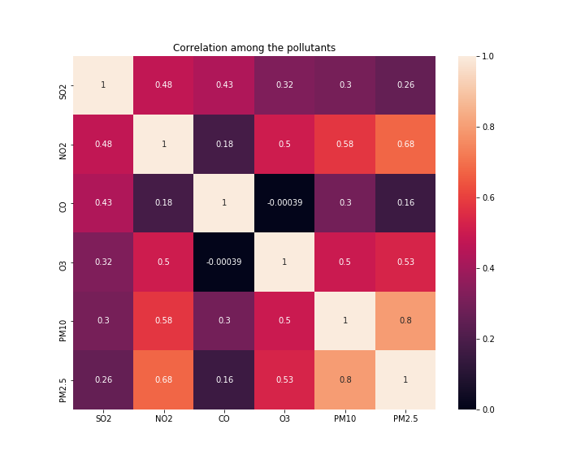
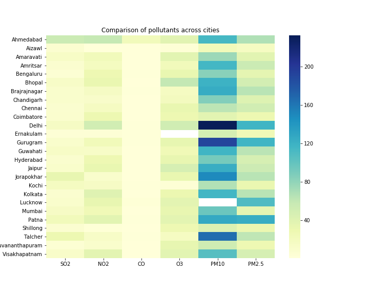

# Exploratory Data Analysis on India's pollution Levels

## Project Overview
- Daily Pollution level data for various Indian cities was fetched from Kaggle.
- Data was pre-processed and cleaned using Pandas library.
- Created an analysis on trend of pollution levels over the last 5 years
- Created an evaluator in order to provide a rating on the basis of pollutant levels recorded.
- Designed heatmaps for correlation among the pollutants as well as pollutants and the cities.
- Analysis on effect of Coronavirus Pandemic on each pollutant as well as AQI.
- Case study of one of the most polluting city in India - **Delhi** 

## What is AQI ?
An air quality index (AQI) is used by government agencies to communicate to the public how polluted the air currently is or how polluted it is forecast to become. Public health risks increase as the AQI rises. Computation of the AQI requires an air pollutant concentration over a specified averaging period, obtained from an air monitor or model. Taken together, concentration and time represent the dose of the air pollutant. Health effects corresponding to a given dose are established by epidemiological research. Air pollutants vary in potency, and the function used to convert from air pollutant concentration to AQI varies by pollutant. Its air quality index values are typically grouped into ranges. Each range is assigned a descriptor, a color code, and a standardized public health advisory.
The AQI can increase due to an increase of air emissions (for example, during rush hour traffic or when there is an upwind forest fire) or from a lack of dilution of air pollutants. Stagnant air, often caused by an anticyclone, temperature inversion, or low wind speeds lets air pollution remain in a local area, leading to high concentrations of pollutants, chemical reactions between air contaminants and hazy conditions.

## Major pollutants (and what causes them)
### SO2(Sulfur Dioxide)
Sulfur dioxide, or SO2 is a colorless gas with a strong odor, similar to a just-struck match. It is formed when fuel containing sulfur, such as coal and oil, is burned, creating air pollution. Most sulfur dioxide air pollution comes from the burning of coal and oil in power plants. It is also emitted by trains, large ships, and some diesel equipment that burns high sulfur fuel, and by volcanic eruptions. Sulfur dioxide is used as a food preservative for some fruits and vegetables. It becomes a liquid under pressure. Sulfur dioxide and nitrogen oxides affect the environment when they react with substances in the atmosphere to form acid rain.
### NO2(Nitrogen Dioxide)
Nitrogen Dioxide (NO2) is one of a group of highly reactive gases known as oxides of nitrogen or nitrogen oxides (NOx). Other nitrogen oxides include nitrous acid and nitric acid. NO2 is used as the indicator for the larger group of nitrogen oxides.NO2 primarily gets in the air from the burning of fuel. NO2 forms from emissions from cars, trucks and buses, power plants, and off-road equipment. Breathing air with a high concentration of NO2 can irritate airways in the human respiratory system. Such exposures over short periods can aggravate respiratory diseases, particularly asthma, leading to respiratory symptoms (such as coughing, wheezing or difficulty breathing), hospital admissions and visits to emergency rooms. Longer exposures to elevated concentrations of NO2 may contribute to the development of asthma and potentially increase susceptibility to respiratory infections.
### CO (Carbon Monoxide)
Carbon monoxide (CO) is a colorless, odorless gas that is a product of the incomplete combustion of carbon-based fuels — including gasoline, diesel fuel, crude oil, and wood — and other natural and synthetic products. Main contributors of carbon monoxide emissions include vehicle exhaust from cars, trucks, and buses; gas-powered furnaces; and portable generators. Carbon monoxide can affect the amount of oxygen carried by the bloodstream to critical organs, including the heart and the brain. Individuals with certain types of heart disease are at elevated risk of health impacts, especially for heart diseases in which the circulation of oxygen to heart tissues is already compromised. People with pre-existing heart issues can become subject to increased symptoms when under higher stress or during exercise, and can experience chest pains, known as angina.
### O3(Ozone)
Ozone in the air we breathe can harm our health. People most at risk from breathing air containing ozone include people with asthma, children, older adults, and people who are active outdoors, especially outdoor workers. In addition, people with certain genetic characteristics, and people with reduced intake of certain nutrients, such as vitamins C and E, are at greater risk from ozone exposure. Breathing ozone can trigger a variety of health problems including chest pain, coughing, throat irritation, and airway inflammation. It also can reduce lung function and harm lung tissue. Ozone can worsen bronchitis, emphysema, and asthma, leading to increased medical care. Learn more about health effects.
### PM2.5(Particulate Matter2.5)
PM2.5 refers to atmospheric particulate matter (PM) that have a diameter of less than 2.5 micrometers, which is about 3% the diameter of a human hair. Commonly written as PM2.5, particles in this category are so small that they can only be seen with a microscope. They are even smaller than their counterparts PM10, which are particles that are 10 micrometres or less, and are also called fine particles. 
Since they are so small and light, fine particles tend to stay longer in the air than heavier particles. This increases the chances of humans and animals inhaling them into the bodies. Owing to their minute size, particles smaller than 2.5 micrometers are able to bypass the nose and throat and penetrate deep into the lungs and some may even enter the circulatory system. Studies have found a close link between exposure to fine particles and premature death from heart and lung disease. Fine particles are also known to trigger or worsen chronic disease such as asthma, heart attack, bronchitis and other respiratory problems.
### PM10(Particulate Matter10)
PM10 are very small particles found in dust and smoke. They have a diameter of 10 micrometres (0.01 mm) or smaller. PM10 particles are small enough to get into your throat and lungs. High levels of PM10 can make you cough, your nose run and eyes sting. People with heart or lung conditions might have more symptoms when PM10 levels are high. Symptoms can include wheezing, chest tightness or difficulty breathing.

Below you can find a correlation heatmap designed to show how multiple pollutants are related to each other.

There is a strong correlation between PM2.5 and PM10. Also, we can see that NO2 and O3 are also correlated to PM2.5 and PM10. This strong correlation helps us determine that the factors causing the rise in these pollutants are also correlated to each other.
Also below is a correlation heatmap for correlation of the various pollutants to the cities. This will show which pollutants are majorly responsible for pollution in these cities.

It can be clearly concluded that majority of the cities have high levels of Particulate Matter2.5 and Particulate Matter10, especially in Delhi and Gurugram where they have degraded the air quality to hazardous level. In case of Ahmedabad, we can see there are minor levels of other pollutants such as Nitrogen dioxide and sulfur dioxide in addition to PM2.5 and PM10. 

## Effect of Covid 19 Pandemic on Air pollution
Amid the COVID-19 pandemic, a nationwide lockdown is imposed in India initially for three weeks from 24th March to 14th April 2020 and was extended up to June 2020. Due to the forced restrictions, pollution level in cities across the country drastically slowed down just within few days which magnetize discussions regarding lockdown to be the effectual alternative measures to be implemented for controlling air pollution. From the below graphs, you can see a visual difference on the level of pollutants as well as the overall AQI before the start of the lockdown phase and after the lockdown began. The data here is for the top 10 most polluting cities in India. In my case study for Delhi, you can see there is a major decline in the level of pollutants.  Nationwide lockdown amid the COVID-19 pandemic provides a unique opportunity to work in this direction. Consequently, quantitative appraisal of air pollution desires to be carried out so as to understand the upshot of lockdown measures on air quality particularly when there is a need to implement such alternative control actions. This study is an effort to assess the usefulness of the lockdown as an alternative strategy for reducing air pollution level in NCT Delhi for instance.

 

As it is evident from the above comparison we see there's a major difference in the levels of AQI over 2015-2019 and 2020. Also there's a sharp decline in the pollution level after the implementation of nationwide lockdown on 23rd March. This resulted in shutting down of all factories and offices across the country. Also, there was a sharp decline in automobiles use as it was prohibited. This vastly improved the air quality especially in cities like Delhi & Gurugram where the automobile pollution was a major factor in making air quality worse. 
According to my analysis, the average AQI level from 2015 till March 2020 was 175. Post Corona, This level has fallen sharply to 85. Also below are the levels of various pollutants from 2015-2019 vs their level in 2020. 

 

 

 

 

 

 

It is evident that the lockdown has made a huge impact on the air pollution level. This also comes up with a fall in economy because of shutting down of factories and public transportation, which provide thousands of jobs to the people. But seeeing on the bright side, this type of regulated and controlled factories shut down and improve the condition of air pollution, especially where AQI levels are abovee the hazardous category.

## Case Study - Delhi
Delhi(NCR to be accurate) has always been in the limelight when it comes to air pollution. Despite being the capital, it always has the highest AQI level for any city in India. Doctors say respiratory problems have become common among children in Delhi-NCR; pollution and dust are the main reasons. Delhi has among the worst air quality in the world, which also impacts its surrounding regions. Of the total deaths in India in 2017, 1.24 million deaths, equivalent to 12·5 percent of total mortalities, could be attributed to air pollution, according to a paper released in 2018 by the India State Level Disease Burden Initiative, published in The Lancet. Scientists have also warned that inhaled air pollutant particles (particulate matter) are moving from the lung to placentas of pregnant women and if they have an effect on the placenta, this will have a direct impact on the foetus. See the bar chart below for a glance at the air quality :

In 2019, The Environment Pollution (Prevention and Control) Authority declared a public health emergency in the Delhi-NCR region and banned all construction activities for almost a month. Schools were asked to close down in that period as well. The prominent pollutant in this period and as it continues to be, is PM2.5. These are fine particulate matter less than 2.5 micrometers in diameter that enables them to easily lodge in the lungs and cause health problems.

### Affect of Covid-19 on Delhi's air pollution 
The nationwide lockdown due to the pandemic has led to a drastic decline of NO2 emissions and reduced air pollution levels. The Levels of PM2.5 and PM10 have also fell. The AQI are the lowest they have been in over the last 5 years. This is mainly due to the restrictions imposed in order to contain the spread of coronavirus. This meant no factories, transportation(both private and public), which were the major cause of pollution in the capital. The averagae AQI has also fallen by >30%. This comes as a good news at a time when the coronavirus have caused a major panic around the world. This also proves that with planned restrictions can drastically improve air quality in Delhi.

.png)

.png)

.png)

.png)

 
.png)

 
.png)

